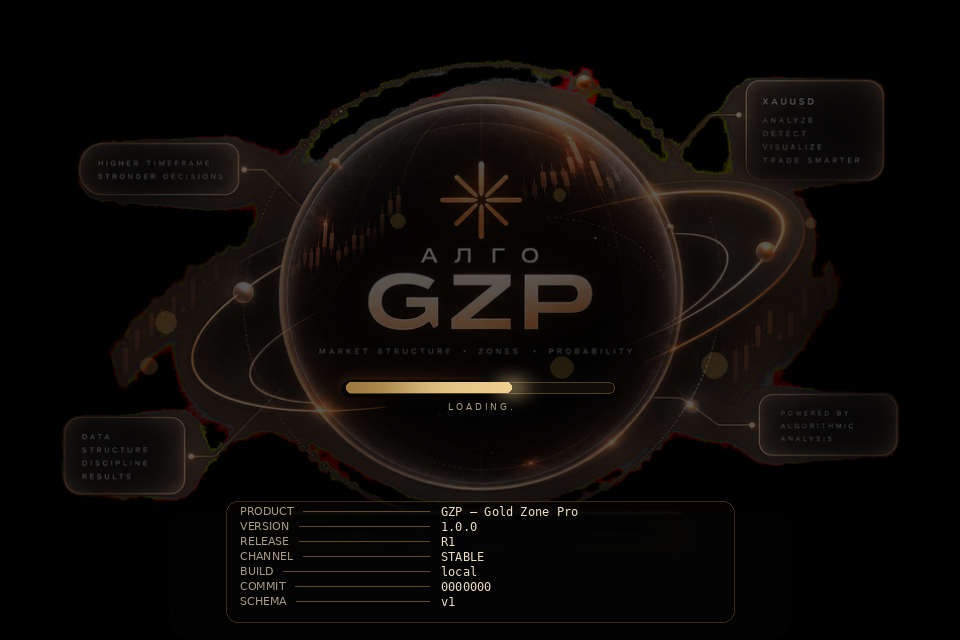

# GZP — Gold Zone Pro

**v1.0.0 · R1 · stable**

Индикатор сильных ценовых зон XAU/USD для MetaTrader 4 и 5.
Второй, независимый алгоритм: зона рождается только из **конфлюенса**
H4-фитиля, H1-подтверждений и исторического S/R — а не из одного уровня.

Алгоритм реализован строго по ТЗ (`docs/TZ_ZONES.md`); соответствие пунктов
ТЗ и кода описано в `docs/ALGORITHM.md` и закреплено тестами.



---

## Что делает продукт

```
        H4 свечи ──► значимые фитили ──► кандидаты
                                            │
        H1 свечи ──► подтверждения ─────────┤
                                            ├──► кластер ──► границы ──► Score
        История  ──► S/R области ───────────┘                              │
                                                                  порог пройден?
                                                                       │
                                                            ┌──────────┴─────────┐
                                                           нет                  да
                                                        игнор            зона зафиксирована
                                                                                │
                                                                    цена приходит позже
                                                                                │
                                                              M5/H1 ──► реакция или пробой
```

Ключевые правила, которые продукт соблюдает:

| Правило | Пункт ТЗ | Где закреплено |
|---|---|---|
| Зона — область, а не уровень | §1, §10 | `boundaries.py`, тест `test_significant_wick_is_detected_with_area` |
| Один фитиль = кандидат, не зона | §5, §29, §55 | `scoring.grade_for`, тест `test_h4_alone_is_only_a_candidate` |
| Близкие реакции = один кластер | §14, §30 | `clustering.py`, тест `test_near_prices_merge_into_one_cluster` |
| Расстояние объединения зависит от ATR | §16 | `config.cluster_merge_atr` |
| Один факт не считается дважды | §25 | `scoring._drop_dependent` |
| Повтор в другое время — ценнее | §26 | `scoring` + тест `test_same_event_is_not_counted_twice` |
| Новый H4 не обязан рождать зону | §35 | тест `test_quiet_market_creates_no_zones` |
| Дубли зон запрещены | §37 | `engine._find_existing` |
| Ширина зоны ограничена | §39 | `boundaries.compute_bounds` |
| Прокол ≠ пробой | §43, §44 | `lifecycle.py` |
| Нет look-ahead bias | §45, §46 | тест `test_zone_creation_uses_only_past_data` |
| Зона никогда не даёт BUY/SELL | §9, §59 | тест `test_zone_itself_carries_no_trade_direction` |
| M5 подключается только после зоны | §60 | тест `test_m5_does_not_create_zones` |

---

## Установка

1. Скачайте `GZP_Setup_<версия>_<релиз>.exe` со страницы
   [Releases](https://github.com/VadimChudin/gzp/releases).
2. Запустите установщик и оставьте галочку «Установить индикатор в терминалы».
3. Запустите GZP → введите пароль продукта на экране Secure Access.
4. Откройте график XAUUSD в MT4/MT5 — индикатор `GZP_Zones` уже подключён.

Установщик сам находит все терминалы (`%APPDATA%\MetaQuotes\Terminal\*`),
кладёт индикатор в `MQL4|MQL5\Indicators\GZP`, создаёт каталог обмена
`Files\GZP` и подключает шаблон графика. Прежний `default.tpl` сохраняется —
удаление продукта возвращает его на место.

---

## Запуск из исходников

```bash
pip install -r requirements.txt

python -m gzp_core.app                  # полный запуск: сплэш → пароль → работа
python -m gzp_core.app --demo           # один прогон без терминалов
python -m gzp_core.app --headless       # без окон (сервер/CI)
python -m gzp_core.app --patch-only     # только установка индикатора
python -m gzp_core.app --unpatch        # удалить индикатор из терминалов
python -m gzp_core.app --render-assets assets   # перерисовать экраны
```

Тесты:

```bash
python -m pytest gzp_core/tests -v
```

---

## Архитектура

```
gzp_core/
  version.py      единая версия/релиз (сплэш, CI, индикатор, инсталлятор)
  config.py       все пороги ТЗ как параметры
  models.py       Candle, Evidence, Zone, ZoneTest, ScoreBreakdown
  indicators.py   ATR, swing high/low
  wicks.py        §4-§12 значимость фитиля + §27, §28 реакция
  sr.py           §21, §22 независимые S/R области
  clustering.py   §13-§16 кластеризация по ATR
  boundaries.py   §20, §39, §53 границы и reference
  scoring.py      §24-§26, §48-§51 Score и независимость факторов
  engine.py       §32-§40, §45-§47 walk-forward, дедупликация
  lifecycle.py    §41-§44, §65 тесты зоны, прокол, пробой
  m5_confirm.py   §60-§63 подтверждение направления (отдельный модуль)
  exporter.py     контракт zones_gzp.json для терминалов
  mt_patcher.py   поиск и патч MT4/MT5
  branding.py     фирменный рендер экранов (Pillow)
  splash.py       анимированный загрузочный экран + ввод пароля
  app.py          точка входа и сервисный цикл

mql/MT4/Indicators/GZP_Zones.mq4
mql/MT5/Indicators/GZP_Zones.mq5
installer/        PyInstaller + Inno Setup + генератор иконки
.github/workflows/release.yml   тесты → .ex4/.ex5 → exe → инсталлятор → Release
```

---

## Контракт данных

Ядро пишет `MQL4|MQL5\Files\GZP\zones_gzp.json` атомарно; индикатор читает и
рисует. Схема версионируется полем `schema` — при несовпадении индикатор
честно сообщает об этом вместо рисования устаревших зон.

```json
{
  "schema": 1,
  "version": "1.0.0",
  "release": "R1",
  "symbol": "XAUUSD",
  "zones": [
    {
      "id": "L4786-202604200800",
      "lower": 4781.0,
      "upper": 4791.0,
      "reference": 4786.0,
      "reaction_type": "lower",
      "score": 109.0,
      "grade": "very_strong",
      "state": "active",
      "tests": 0,
      "confirmations": { "h4": 2, "h1": 2, "sr": 1, "independent_groups": 3 }
    }
  ]
}
```

Полей с торговым решением в контракте нет и не будет: по ТЗ §59 алгоритм
отвечает только на вопрос «эта цена исторически интересна».

---

## Релизы

Тег `v*` запускает публикацию:

```bash
git tag v1.0.0 && git push origin v1.0.0
```

CI прогоняет тесты, компилирует `.ex4/.ex5` в MetaEditor, собирает `GZP.exe`
и `GZP_Setup_*.exe` и публикует их в Releases.
